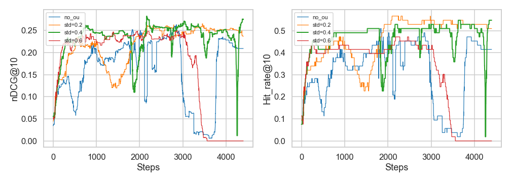

# Reinforcement learning for Recommendation Systems

Implementation of [Deep Reinforcement Learning based Recommendation with Explicit User-Item Interactions Modeling](https://arxiv.org/pdf/1810.12027.pdf). 

Some of the code were reused from [Catalyst demo notebook](https://github.com/catalyst-team/catalyst/blob/master/examples/notebooks/demo.ipynb) and [higgsfield's RL-Adventure](https://github.com/higgsfield/RL-Adventure-2/), it helps a lot.

TODO:

- [x] Implement validation 
- [x] Change training process (switch to sessions)
- [x] Add Prioritized Experience Replay

Special TODO:

- [x] Add Ornstein–Uhlenbeck noise for better exploration

#### Movielens (1M) results

| Model                          | nDCG@10 | hit_rate@10 |
| ------------------------------ | :-----: | ----------- |
| **DDPG with OU noise**         |  0.280  | 0.502       |
| DDPG                           |  0.254  | 0.454       |
| Neural Collaborative Filtering |  0.238  | 0.430       |
| Random (for comparison)        |  ~0.05  | ~0.1        |

